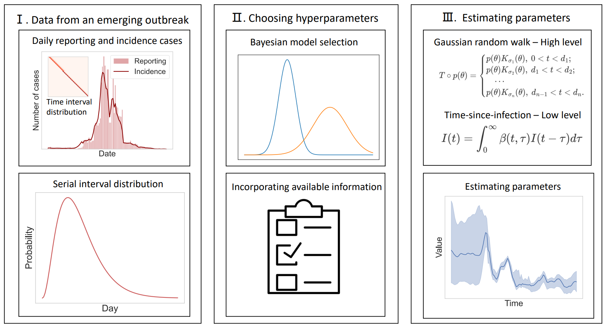
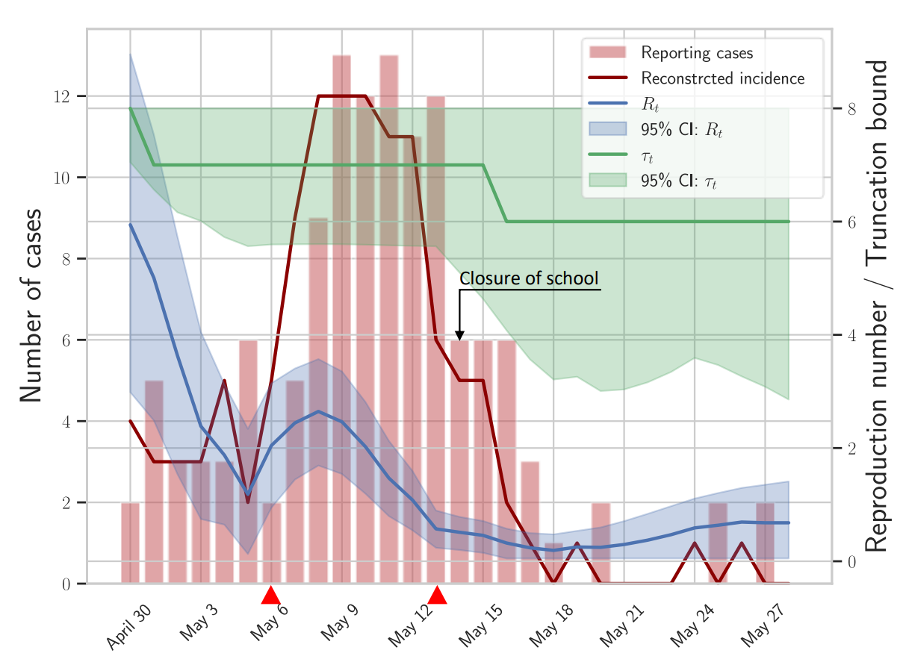
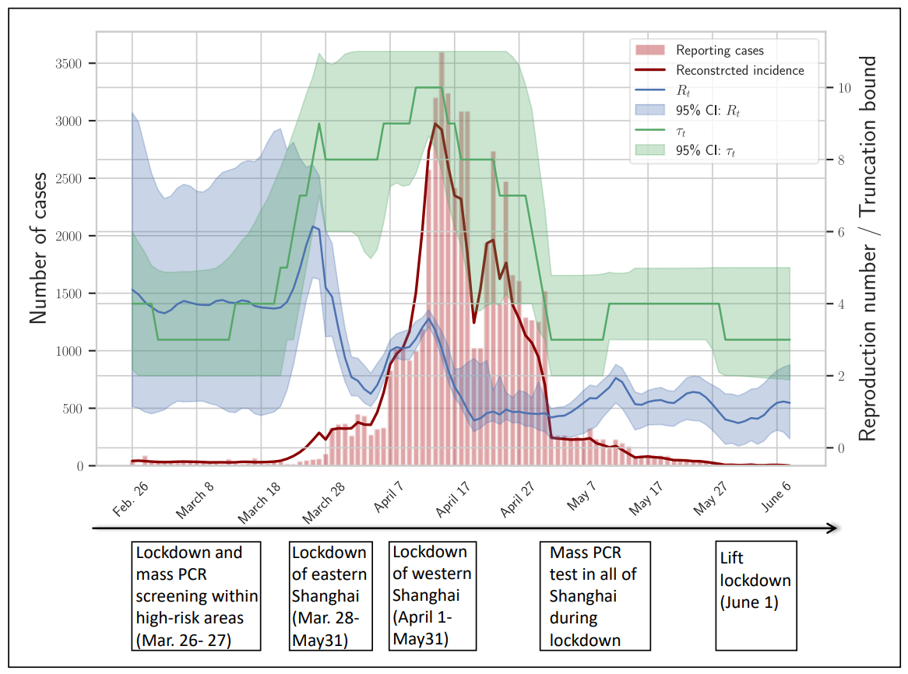

# README

Python implementation of a Bayesian statistical framework for modelling and analysing emerging outbreaks.



The dynamics of an emerging outbreaks is modelled with a hierarchical Bayesian model. On short time scales, the incident was depicted with a renewal process based on Kermack-McKendrick model with key parameters quantifying the effect of mitigation and quarantine, while on long times scales these time-varying parameters were modelled via Gaussian random walk with changing standard deviation. This model allows incorporating of available information about interventions by configuring high-level model, e.g. setting specific structural break points at initialisation of public health measures.

## Dependencies

```
bayesloop==1.5.6
loguru==0.6.0
numpy==1.23.0
optuna==3.0.3
pandas==1.4.3
scipy==1.8.1
```

## Examples

We demonstrated how to explore possible structural break points during an emerging outbreak and how epidemiological quantities could be inferred using data from outbreaks of H1N1 influenza and SARS-CoV-2 Omicron variant. 

### H1N1 influenza in a school in Pennsylvania, 2009

The sequence of cases, which is defined as onset of acute respiratory illness, is provided in the EpiEstim, an R software package. This data is also available as supplement material at [Improved inference of time-varying reproduction numbers during infectious disease outbreaks](https://www.sciencedirect.com/science/article/pii/S1755436519300350). 



### SARS-CoV-2 Omicron variant outbreak in Shanghai, China, 2022

Aggregated data of daily confirmed cases were gathered from [John Hopkins University database](https://github.com/CSSEGISandData/COVID-19).



Details of both examples are available at JupyterNotebook file in this repository.
